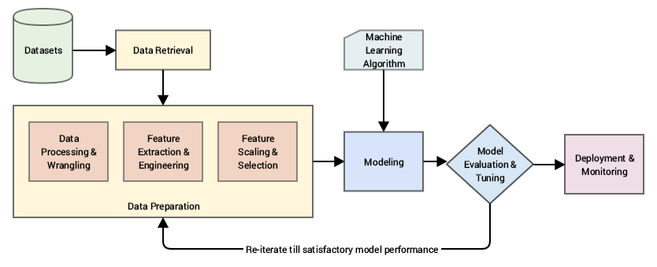

**What is Feature Engineering?**

Feature engineering involves selecting, creating, or transforming features from raw data to make it more suitable for machine learning models. Features, also called dimensions or input variables, are the elements that models use to learn patterns and make predictions. The quality and relevance of features directly impact model accuracy, efficiency, and generalizability.


Feature Engineering is the process of transforming raw data into meaningful and informative features that improve machine learning model performance.

It is one of the most critical steps in the ML pipeline.
---
# Pillar 1: Data Cleaning 
## Objective
Remove noise, inconsistencies, and errors from raw data.

## Key Techniques
- Handling missing values (mean / median / mode / model-based)
- Removing duplicates
- Handling outliers (IQR / Z-score)
- Fixing incorrect data types
- Correcting inconsistent labels

## Example
```python
df['age'].fillna(df['age'].median(), inplace=True)
```
# Pillar 2: Feature Transformation 

Feature Transformation is the process of converting raw data into a format that machine learning algorithms can effectively understand and learn from.

It ensures that features are properly scaled, encoded, and structured for optimal model performance.

---

##  Objective

- Convert categorical data into numerical format
- Scale numerical features
- Normalize data distributions
- Extract meaningful components from complex data types

---

##  Why Feature Transformation is Important

- Many ML algorithms assume numerical input
- Some models are sensitive to feature scale (e.g., distance-based models)
- Proper transformation improves convergence speed
- Prevents dominance of high-magnitude features

---

# Types of Feature Transformation

---

## Encoding Categorical Variables

Machine learning models cannot process text directly.

### Techniques:
- **One-Hot Encoding**
- **Label Encoding**
- **Ordinal Encoding**
- **Target Encoding**

### Example:
```python
from sklearn.preprocessing import OneHotEncoder

encoder = OneHotEncoder()
encoded_data = encoder.fit_transform(df[['category']])
```
# Pillar 3: Feature Construction 

Feature Construction is the process of creating new meaningful features from existing data to improve model performance.

This is where domain knowledge and analytical thinking significantly impact model accuracy.

---

##  Objective

- Extract hidden patterns
- Capture relationships between variables
- Increase model expressiveness
- Improve predictive power

---

##  Why Feature Construction is Important

Raw data rarely contains the exact signals needed by a model.

Well-constructed features:
- Reveal non-linear relationships
- Capture interactions between variables
- Improve model generalization
- Reduce bias

Better features → Better predictions.

---

#  Types of Feature Construction

---

## 1️ Mathematical Transformations

Create new features using mathematical operations.

### Examples:
- Polynomial features (x², x³)
- Interaction terms (x1 * x2)
- Ratios (price / quantity)

### Example:
```python
df['price_per_item'] = df['total_price'] / df['quantity']
df['age_squared'] = df['age'] ** 2
```
# Pillar 4: Feature Selection 

Feature Selection is the process of identifying and selecting the most relevant features for model training while removing irrelevant, redundant, or noisy variables.

The goal is to improve model performance, reduce overfitting, and decrease computational cost.

---

##  Objective

- Remove irrelevant features
- Reduce dimensionality
- Improve generalization
- Increase model interpretability
- Reduce training time

---

##  Why Feature Selection is Important

Too many features can cause:

- Overfitting
- Increased model complexity
- Longer training time
- Curse of dimensionality
- Reduced interpretability

Better features → Simpler model → Better generalization.

---

#  Types of Feature Selection Methods

---

## 1️ Filter Methods

Evaluate features based on statistical properties.

### Techniques:
- Correlation threshold
- Chi-Square test
- ANOVA test
- Variance Threshold

### Example:
```python
from sklearn.feature_selection import VarianceThreshold

selector = VarianceThreshold(threshold=0.01)
X_selected = selector.fit_transform(X)