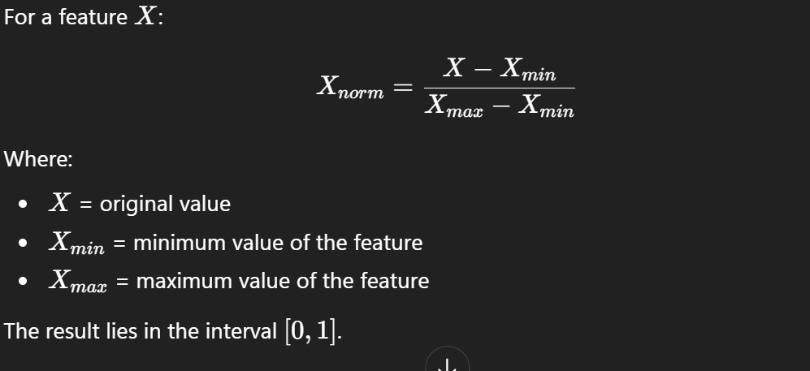

## 1. Definition

Normalization is a feature scaling technique that transforms numerical features into a fixed range, typically [0, 1],
using the Min–Max transformation.

It ensures that all features contribute proportionally to model training, especially in algorithms sensitive to
magnitude.

---

## 2. Mathematical Formulation

---

## 3. Requirement of Normalization

Many ML algorithms are sensitive to the scale of input features.

A. Distance-Based Algorithms

Examples:

K-Nearest Neighbors (KNN)

K-Means Clustering

Support Vector Machines (RBF kernel)

Distance metrics such as Euclidean distance are directly influenced by feature magnitude. Without normalization,
features with larger ranges dominate the distance calculation.